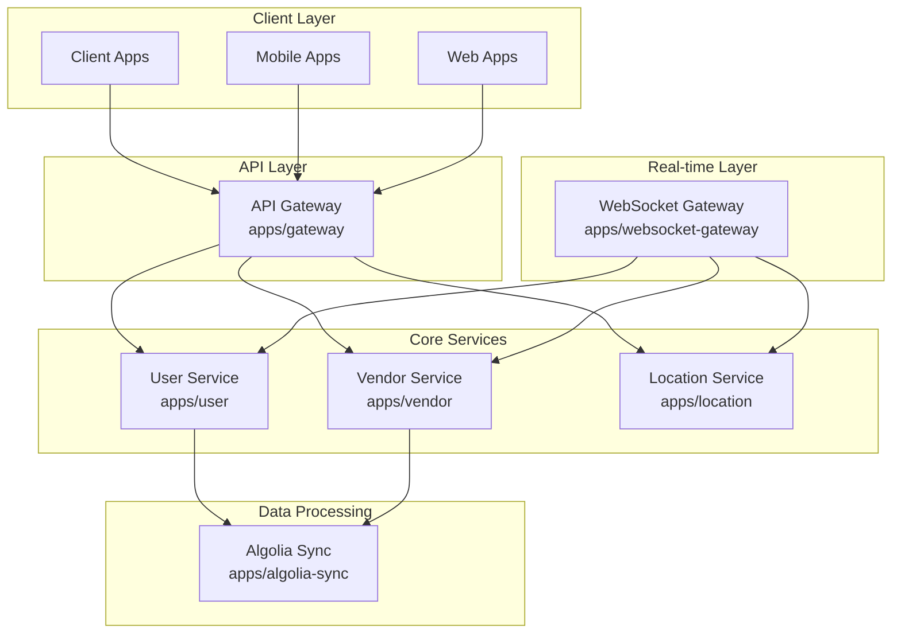
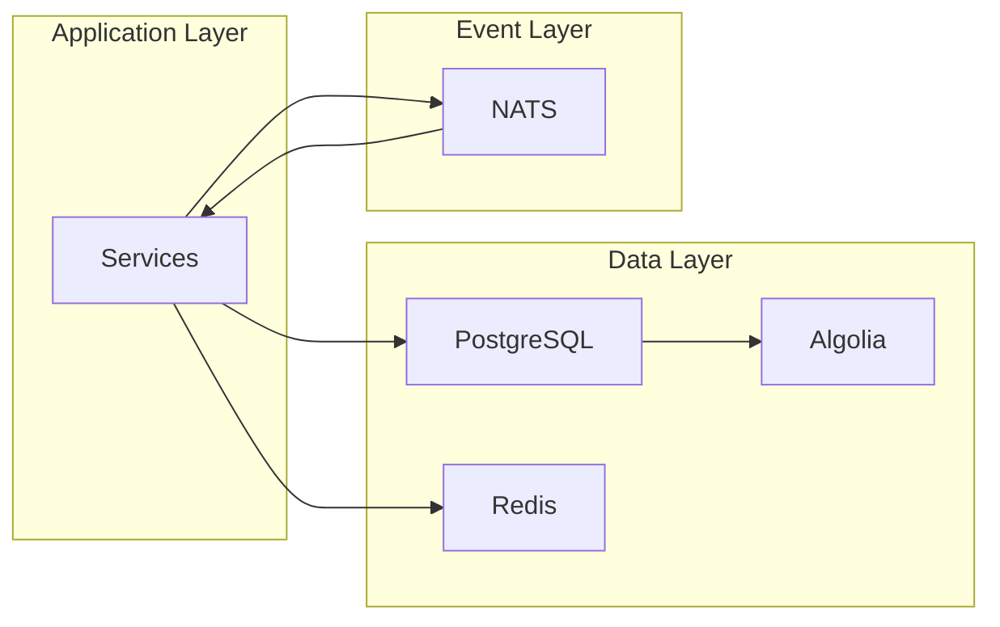

# 🏗️ Architecture Overview

## 📋 Table of Contents

- [System Architecture](#system-architecture)
- [Service Architecture](#service-architecture)
- [Communication Patterns](#communication-patterns)
- [Data Architecture](#data-architecture)
- [Security Architecture](#security-architecture)
- [Monitoring & Observability](#monitoring--observability)
- [Scalability Considerations](#scalability-considerations)
- [Deployment Architecture](#deployment-architecture)
- [Development Workflow](#development-workflow)

## 🏛️ System Architecture

The Venta Backend is built as a **microservices-based system** using NestJS, following modern architectural patterns for scalability, maintainability, and reliability.

### 🎯 High-Level Architecture



## 🔧 Service Architecture

### 🎯 Core Services

#### 1. **API Gateway** (`apps/gateway`)
- **🎯 Purpose**: Main entry point for all client requests
- **📋 Responsibilities**:
  - Request routing and load balancing
  - Authentication and authorization
  - Rate limiting and throttling
  - Request/response transformation
  - API versioning
- **🔗 Communication**: HTTP/REST APIs, gRPC client to other services
- **🔌 Port**: Configurable via `GATEWAY_SERVICE_PORT` environment variable

#### 2. **User Service** (`apps/user`)
- **🎯 Purpose**: User management and webhook handling
- **📋 Responsibilities**:
  - Clerk webhook processing (user creation/deletion)
  - RevenueCat subscription webhook handling
  - User-vendor association management
  - User data synchronization
- **🔗 Communication**: gRPC server, HTTP webhooks (Clerk, RevenueCat)
- **🔌 Port**: Configurable via `USER_SERVICE_ADDRESS` environment variable (default: localhost:5000)

#### 3. **Vendor Service** (`apps/vendor`)
- **🎯 Purpose**: Vendor and business management
- **📋 Responsibilities**:
  - Vendor profile management (CRUD operations)
  - Business information and settings
  - Vendor data synchronization
  - Vendor lookup and retrieval
- **🔗 Communication**: gRPC server
- **🔌 Port**: Configurable via `VENDOR_SERVICE_ADDRESS` environment variable (default: localhost:5005)

#### 4. **Location Service** (`apps/location`)
- **🎯 Purpose**: Real-time location tracking and geospatial operations
- **📋 Responsibilities**:
  - Vendor location updates and management
  - Geospatial queries for vendor locations
  - Location-based vendor discovery
  - Location data synchronization
- **🔗 Communication**: gRPC server
- **🔌 Port**: Configurable via `LOCATION_SERVICE_ADDRESS` environment variable (default: localhost:5001)

#### 5. **WebSocket Gateway** (`apps/websocket-gateway`)
- **🎯 Purpose**: Real-time communication hub (separate from HTTP gateway)
- **📋 Responsibilities**:
  - WebSocket connections management
  - Real-time location updates for users and vendors
  - Live notifications and events
  - Connection state management
- **🔗 Communication**: WebSocket server, gRPC client to other services
- **🔌 Port**: Configurable via `WEBSOCKET_GATEWAY_SERVICE_PORT` environment variable

#### 6. **Algolia Sync** (`apps/algolia-sync`)
- **🎯 Purpose**: Search index synchronization
- **📋 Responsibilities**:
  - Data synchronization with Algolia
  - Search index optimization
  - Search analytics and monitoring
- **🔗 Communication**: HTTP client (Algolia API)
- **🔌 Port**: Configurable via `ALGOLIA_SYNC_SERVICE_PORT` environment variable

## 🔄 Communication Patterns

### 1. **Synchronous Communication**

#### gRPC
- **✅ Type-safe and high-performance**
- **✅ Protocol Buffers for data serialization**
- **✅ Bidirectional streaming support**
- **✅ Used for inter-service communication**

#### HTTP/REST
- **✅ Standard RESTful endpoints**
- **✅ JSON payloads**
- **✅ Stateless communication**
- **✅ Webhook processing (Clerk, RevenueCat)**

### 2. **Asynchronous Communication**

#### NATS
- **✅ Message broker for event-driven communication**
- **✅ Pub/sub pattern for loose coupling**
- **✅ Event sourcing and CQRS support**
- **✅ Reliable message delivery**

#### WebSocket
- **✅ Real-time bidirectional communication**
- **✅ Live updates and notifications**
- **✅ Connection state management**
- **✅ Event-driven architecture**

#### HTTP Webhooks
- **✅ External service integration**
- **✅ Clerk user events (creation, deletion)**
- **✅ RevenueCat subscription events**
- **✅ Third-party service notifications**

### 3. **Event-Driven Architecture**

| Event Type | Description | Examples |
|------------|-------------|----------|
| **Domain Events** | Business events that trigger actions across services | `vendor.created`, `user.updated` |
| **Integration Events** | Events for external system integration | `algolia.sync`, `email.sent` |
| **WebSocket Events** | Real-time events for client applications | `location.updated`, `notification.received` |
| **Webhook Events** | External service events | `clerk.user.created`, `revenuecat.subscription.updated` |

## 🗄️ Data Architecture

### Database Strategy

#### **Primary Database**: PostgreSQL
- **✅ ACID compliance** for transactional data
- **✅ JSON support** for flexible schemas
- **✅ Geospatial extensions** for location data
- **✅ Prisma ORM** for type-safe database access

#### **Caching Layer**: Redis
- **✅ Session management**
- **✅ Rate limiting**
- **✅ Temporary data storage**
- **✅ Pub/sub messaging**

#### **Search Engine**: Algolia
- **✅ Full-text search capabilities**
- **✅ Real-time indexing**
- **✅ Advanced search features**
- **✅ Analytics and insights**

### Data Flow



## 🔒 Security Architecture

### Authentication & Authorization

#### **Clerk Integration**
- **✅ Third-party authentication service**
- **✅ JWT token management**
- **✅ Multi-factor authentication**
- **✅ Social login integration**

#### **NestJS Guards**
- **✅ Authentication guards**
- **✅ Authorization guards**
- **✅ Rate limiting guards**
- **✅ Webhook signature validation**

### Data Protection

| Security Measure | Implementation | Purpose |
|------------------|----------------|---------|
| **Encryption** | Data encryption at rest and in transit | Protect sensitive data |
| **Input Validation** | Schema validation using Zod | Prevent injection attacks |
| **Rate Limiting** | Protection against abuse | Prevent DoS attacks |
| **CORS** | Cross-origin resource sharing configuration | Control access from different origins |

## 📊 Monitoring & Observability

### Metrics & Monitoring

#### **Prometheus**
- **✅ Metrics collection and storage**
- **✅ Custom business metrics**
- **✅ Service health monitoring**

#### **Grafana**
- **✅ Metrics visualization and dashboards**
- **✅ Real-time monitoring**
- **✅ Alerting and notifications**

#### **Health Checks**
- **✅ Service health monitoring**
- **✅ Database connectivity checks**
- **✅ External service dependencies**

### Logging & Tracing

#### **Structured Logging**
- **✅ JSON-formatted logs**
- **✅ Request ID correlation**
- **✅ Error tracking and monitoring**

#### **Distributed Tracing**
- **✅ Request tracing with request IDs**
- **✅ Cross-service correlation**
- **✅ Performance monitoring**

## 📈 Scalability Considerations

### Horizontal Scaling

#### **Stateless Services**
- **✅ All services are stateless** for easy scaling
- **✅ Multiple instances can be deployed**
- **✅ Load balancing across instances**

#### **Database Scaling**
- **✅ PostgreSQL can be sharded if needed**
- **✅ Read replicas for read-heavy workloads**
- **✅ Connection pooling for efficient resource usage**

#### **Cache Distribution**
- **✅ Redis cluster for high availability**
- **✅ Distributed caching strategies**
- **✅ Cache invalidation patterns**

### Performance Optimization

| Optimization | Implementation | Benefit |
|--------------|----------------|---------|
| **Connection Pooling** | Database connection management | Reduced connection overhead |
| **Caching Strategy** | Multi-layer caching approach | Faster response times |
| **Async Processing** | Non-blocking operations | Better resource utilization |
| **CDN Integration** | Static asset delivery | Reduced latency |

## 🚀 Deployment Architecture

### Containerization

#### **Docker**
- **✅ All services containerized**
- **✅ Consistent runtime environment**
- **✅ Easy deployment and scaling**

#### **Docker Compose**
- **✅ Local development environment**
- **✅ Service orchestration**
- **✅ Environment-specific configurations**

#### **Multi-stage Builds**
- **✅ Optimized production images**
- **✅ Reduced image sizes**
- **✅ Security best practices**

### Infrastructure

#### **Kubernetes Ready**
- **✅ Services designed for K8s deployment**
- **✅ Health checks and readiness probes**
- **✅ Resource limits and requests**

#### **Environment Configuration**
- **✅ Environment-specific configs**
- **✅ Secrets management**
- **✅ Configuration validation**

## 💻 Development Workflow

### Code Organization

#### **Monorepo Structure**
```
venta-backend/
├── apps/                    # Microservices
│   ├── gateway/            # API Gateway
│   ├── user/               # User Service
│   ├── vendor/             # Vendor Service
│   ├── location/           # Location Service
│   ├── websocket-gateway/  # WebSocket Gateway
│   └── algolia-sync/       # Algolia Sync Service
├── libs/                   # Shared Libraries
│   ├── apitypes/           # API Types and Schemas
│   ├── nest/               # NestJS Shared Modules
│   ├── proto/              # Protocol Buffers
│   └── utils/              # Utility Functions
├── docs/                   # Documentation
├── prisma/                 # Database Schema
├── test/                   # Test Utilities
└── docker/                 # Docker Configuration
```

#### **Shared Libraries**
- **✅ Type safety** throughout the stack
- **✅ Code reusability** across services
- **✅ Consistent patterns** and utilities

### Testing Strategy

#### **Testing Pyramid**
```
        /\
       /  \     E2E Tests (Few)
      /____\    
     /      \   Integration Tests (Some)
    /________\  
   /          \ Unit Tests (Many)
  /____________\
```

#### **Quality Assurance**
- **✅ ESLint** for code quality
- **✅ Prettier** for code formatting
- **✅ Vitest** for fast unit testing
- **✅ Comprehensive test coverage**

## 🎯 Key Benefits

This architecture provides:

- **🚀 Scalability**: Horizontal scaling capabilities
- **🔧 Maintainability**: Clear separation of concerns
- **🛡️ Reliability**: Fault tolerance and error handling
- **⚡ Performance**: Optimized communication patterns
- **🔒 Security**: Comprehensive security measures
- **📊 Observability**: Complete monitoring and tracing
- **🔄 Flexibility**: Easy to extend and modify

---

**This architecture provides a solid foundation for building scalable, maintainable, and reliable microservices that can evolve with business needs.** 