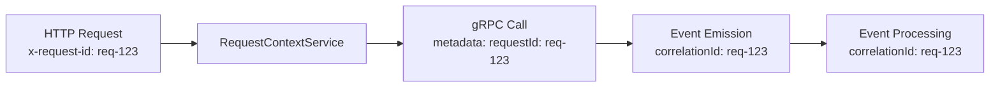

# 🔄 Event System with Automatic Intellisense

## 📋 Table of Contents

- [Overview](#overview)
- [Architecture](#architecture)
- [Usage Examples](#usage-examples)
- [Correlation ID Integration](#correlation-id-integration)
- [Current Vendor Events](#current-vendor-events)
- [Benefits](#benefits)
- [File Structure](#file-structure)
- [Configuration](#configuration)
- [Future Extensibility](#future-extensibility)

## 🎯 Overview

We've implemented a **clean, type-safe event system** that provides automatic intellisense for vendor events. The system automatically derives available subjects from domain-specific event definitions and integrates with request ID propagation for correlation tracking.

## 🏗️ Architecture

### **Domain-Driven Event Definitions**

Vendor events are defined in a dedicated file:

```typescript
// libs/apitypes/src/lib/vendor/vendor.events.ts
export const vendorEventDataSchema = z.object({
  id: z.string(),
  lat: z.number().nullable(),
  long: z.number().nullable(),
  name: z.string(),
  description: z.string().nullable(),
  phone: z.string().nullable(),
  email: z.string().nullable(),
  website: z.string().nullable(),
  open: z.boolean(),
  primaryImage: z.string().nullable(),
  createdAt: z.date(),
  updatedAt: z.date(),
}).passthrough(); // Allow additional fields (like relations) to pass through

export const vendorLocationEventDataSchema = z.object({
  location: z.object({
    lat: z.number(),
    long: z.number(),
  }),
  timestamp: z.date(),
  vendorId: z.string(),
});

export const vendorEventSchemas = {
  'vendor.created': vendorEventDataSchema,
  'vendor.updated': vendorEventDataSchema,
  'vendor.deleted': vendorEventDataSchema,
  'vendor.location.updated': vendorLocationEventDataSchema,
} as const;
```

### **Unified Event Registry**

All vendor subjects are combined into a single type:

```typescript
// libs/apitypes/src/lib/events/unified-event-registry.ts
import { vendorEventSchemas } from '../vendor/vendor.events';

export const ALL_EVENT_SCHEMAS = {
  ...vendorEventSchemas,
  // Add other domain schemas here as they're created:
  // ...userEventSchemas,
  // ...locationEventSchemas,
} as const;

export type AvailableEventSubjects = keyof typeof ALL_EVENT_SCHEMAS;
```

### **Type-Safe Event Service**

The event service provides automatic intellisense and type safety:

```typescript
@Injectable()
export class EventService {
  async emit<TSubject extends AvailableEventSubjects>(
    subject: TSubject, // ← Intellisense here!
    data: EventDataMap[TSubject], // ← Type-safe data based on subject!
    metadata?: EventMetadata,
  ): Promise<void> {
    // Automatically validates against schema from unified registry
    const schema = ALL_EVENT_SCHEMAS[subject];
    const validatedData = schema ? schema.parse(data) : data;
    // ... emit event
  }
}
```

## 💡 Usage Examples

### **Simple Event Emission with Intellisense**

```typescript
// In vendor service
@Injectable()
export class VendorService {
  constructor(private eventService: EventService) {}

  async createVendor(data: VendorCreateData) {
    const vendor = await this.prisma.db.vendor.create({...});

    // TypeScript provides intellisense for subjects AND type safety for data
    await this.eventService.emit('vendor.created', vendor);
    //                                    ↑ Intellisense shows: 'vendor.created' | 'vendor.updated' | 'vendor.deleted' | 'vendor.location.updated'
    //                                    ↑ Data must match vendorEventDataSchema type
    return vendor.id;
  }
}
```

### **Location Service Example**

```typescript
// In location service
@Injectable()
export class LocationService {
  constructor(private eventService: EventService) {}

  async updateVendorLocation(data: LocationUpdate) {
    // Update location logic...
    
    await this.eventService.emit('vendor.location.updated', {
      location: {
        lat: data.location.lat,
        long: data.location.long,
      },
      timestamp: new Date(),
      vendorId: data.entityId,
    });
  }
}
```

## 🔗 Correlation ID Integration

The event system automatically integrates with the existing request ID propagation system:

### **Automatic Correlation ID**

```typescript
// Events automatically get correlation ID from request context
const event: BaseEvent = {
  correlationId: metadata?.correlationId || this.requestContextService?.get('requestId'),
  data: validatedData,
  eventId: randomUUID(),
  source: metadata?.source || this.appName,
  timestamp: new Date().toISOString(),
  version: metadata?.version || '1.0',
};
```

### **Request Tracing**

When a request comes in:



1. **HTTP**: `x-request-id` header → `RequestContextService`
2. **gRPC**: Request metadata → `RequestContextService` 
3. **Events**: Same request ID becomes correlation ID
4. **Logs**: Same request ID for tracing

All events from the same request will have the same correlation ID, making it easy to trace the entire request flow.

## 🔄 Complete Request Flow Example

### **Vendor Creation Request**

#### **Step 1: HTTP Request** (Gateway)
```
POST /vendors
Headers: x-request-id: req-123
```

#### **Step 2: Request ID Generation**
- Pino generates/uses request ID: `req-123`
- Stored in request context

#### **Step 3: gRPC Call** (Gateway → Vendor Service)
```
gRPC: createVendor(data)
Metadata: requestId: req-123
```

#### **Step 4: Vendor Service Processing**
- Extracts request ID from gRPC metadata
- Stores in `RequestContextService`
- Creates vendor in database

#### **Step 5: Event Emission**
```typescript
await this.eventService.emit('vendor.created', vendor);
// Event automatically gets correlationId: req-123
```

#### **Step 6: Event Processing** (Algolia Sync)
- Receives event with correlation ID: `req-123`
- Processes vendor data
- Logs include correlation ID for tracing

#### **Step 7: Complete Trace**
```
Gateway: [req-123] HTTP request received
Gateway: [req-123] gRPC call to vendor service
Vendor:  [req-123] Vendor created
Vendor:  [req-123] Event emitted: vendor.created
Algolia: [req-123] Event received: vendor.created
Algolia: [req-123] Vendor synced to Algolia
```

### **Benefits of Integrated Tracing**:
- ✅ **Single Request ID**: Same ID across HTTP, gRPC, events, and logs
- ✅ **Automatic Propagation**: No manual correlation ID management
- ✅ **Complete Visibility**: Trace entire request flow end-to-end
- ✅ **Easy Debugging**: Find all related logs and events by request ID

## 📊 Current Vendor Events

| Event | Service | Description | Data Schema |
|-------|---------|-------------|-------------|
| `vendor.created` | Vendor Service | New vendor created | `vendorEventDataSchema` |
| `vendor.updated` | Vendor Service | Vendor data updated | `vendorEventDataSchema` |
| `vendor.deleted` | Vendor Service | Vendor deleted | `vendorEventDataSchema` |
| `vendor.location.updated` | Location Service | Vendor location changed | `vendorLocationEventDataSchema` |

## ✅ Benefits

### **1. Automatic Intellisense**
- ✅ TypeScript provides autocomplete for all available vendor events
- ✅ Compile-time validation of event subjects
- ✅ No more typos in event names

### **2. Type Safety**
- ✅ Full TypeScript support with automatic type inference
- ✅ Automatic schema validation
- ✅ Compile-time error checking

### **3. No Duplication**
- ✅ Event subjects defined once in vendor domain
- ✅ Automatically combined into unified type
- ✅ Single source of truth

### **4. Request Tracing**
- ✅ Automatic correlation ID from request context
- ✅ Consistent tracing across logs and events
- ✅ Easy debugging and monitoring

### **5. Clean API**
- ✅ Simple `emit(subject, data)` interface
- ✅ Automatic validation from registry
- ✅ Optional metadata support

## 📁 File Structure

```
libs/apitypes/src/lib/
├── 📁 events/
│   ├── 📄 base.types.ts              # Shared base types
│   ├── 📄 unified-event-registry.ts  # Combined subjects type
│   └── 📄 index.ts                   # Exports
├── 📁 vendor/
│   ├── 📄 vendor.events.ts           # Vendor event definitions
│   └── 📄 index.ts                   # Exports
└── 📄 index.ts                       # Main exports
```

## ⚙️ Configuration

### **Module Setup**
```typescript
@Module({
  imports: [
    EventsModule, // Provides EventService
    RequestContextModule, // Provides RequestContextService for correlation IDs
  ],
  providers: [VendorService],
})
export class VendorModule {}
```

## 🚀 Future Extensibility

### **Adding New Vendor Events:**

#### **Step 1: Add schema** to `vendor.events.ts`
```typescript
export const vendorStatusEventDataSchema = z.object({
  vendorId: z.string(),
  status: z.enum(['active', 'inactive', 'suspended']),
  reason: z.string().optional(),
  timestamp: z.date(),
});

export const vendorEventSchemas = {
  'vendor.created': vendorEventDataSchema,
  'vendor.updated': vendorEventDataSchema,
  'vendor.deleted': vendorEventDataSchema,
  'vendor.location.updated': vendorLocationEventDataSchema,
  'vendor.status.changed': vendorStatusEventDataSchema, // ← New event
} as const;
```

#### **Step 2: Add to schemas object** - types automatically update
#### **Step 3: Use in service** - intellisense immediately available

### **Adding New Domains:**

#### **Step 1: Create domain events file** (e.g., `user.events.ts`)
```typescript
// libs/apitypes/src/lib/user/user.events.ts
export const userEventSchemas = {
  'user.created': userEventDataSchema,
  'user.updated': userEventDataSchema,
  'user.deleted': userEventDataSchema,
} as const;
```

#### **Step 2: Add to unified registry** - types automatically combine
```typescript
// libs/apitypes/src/lib/events/unified-event-registry.ts
import { vendorEventSchemas } from '../vendor/vendor.events';
import { userEventSchemas } from '../user/user.events';

export const ALL_EVENT_SCHEMAS = {
  ...vendorEventSchemas,
  ...userEventSchemas, // ← New domain
} as const;
```

#### **Step 3: Import in services** - full type safety and intellisense

## 🔧 Event Schema Examples

### **Vendor Event Schemas**

```typescript
// Complete vendor event schemas
export const vendorEventSchemas = {
  'vendor.created': z.object({
    id: z.string(),
    name: z.string(),
    email: z.string().email(),
    phone: z.string().optional(),
    website: z.string().url().optional(),
    description: z.string().optional(),
    open: z.boolean(),
    primaryImage: z.string().url().optional(),
    lat: z.number().nullable(),
    long: z.number().nullable(),
    createdAt: z.date(),
    updatedAt: z.date(),
  }),
  
  'vendor.updated': z.object({
    id: z.string(),
    name: z.string().optional(),
    email: z.string().email().optional(),
    phone: z.string().optional(),
    website: z.string().url().optional(),
    description: z.string().optional(),
    open: z.boolean().optional(),
    primaryImage: z.string().url().optional(),
    lat: z.number().nullable().optional(),
    long: z.number().nullable().optional(),
    updatedAt: z.date(),
  }),
  
  'vendor.deleted': z.object({
    id: z.string(),
    deletedAt: z.date(),
  }),
  
  'vendor.location.updated': z.object({
    vendorId: z.string(),
    location: z.object({
      lat: z.number(),
      long: z.number(),
    }),
    timestamp: z.date(),
  }),
} as const;
```

## 📈 Performance Considerations

### **Event Validation**
- ✅ **Schema validation** happens at runtime
- ✅ **Type checking** happens at compile time
- ✅ **Minimal overhead** for production builds

### **Memory Usage**
- ✅ **Shared schemas** across all services
- ✅ **Tree-shaking** removes unused schemas
- ✅ **Efficient validation** with Zod

### **Bundle Size**
- ✅ **Tree-shakable** imports
- ✅ **Only include** schemas you use
- ✅ **Minimal impact** on bundle size

## 🧪 Testing

### **Event Testing Examples**

```typescript
describe('VendorService', () => {
  it('should emit vendor.created event', async () => {
    const vendor = await service.createVendor(vendorData);
    
    expect(eventService.emit).toHaveBeenCalledWith(
      'vendor.created',
      expect.objectContaining({
        id: vendor.id,
        name: vendor.name,
      })
    );
  });
  
  it('should validate event data against schema', async () => {
    const invalidData = { id: '123' }; // Missing required fields
    
    await expect(
      eventService.emit('vendor.created', invalidData)
    ).rejects.toThrow('Validation failed');
  });
});
```

## 🎯 Conclusion

This event system provides:

- **🔍 Automatic intellisense** for all vendor events
- **🛡️ Type safety** with compile-time validation
- **🔗 Request tracing** with automatic correlation IDs
- **🏗️ Clean architecture** with no duplication
- **🚀 Easy extensibility** for future domains

The system automatically derives available events from domain definitions, provides the best developer experience with full TypeScript support and intellisense, and integrates seamlessly with the existing request ID propagation system.

---

**This event system provides a robust foundation for building scalable, type-safe, and maintainable event-driven microservices.**
