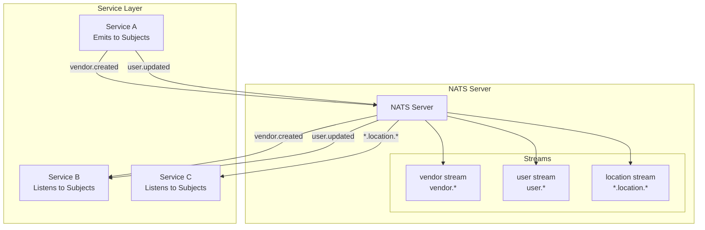
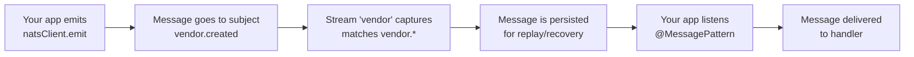
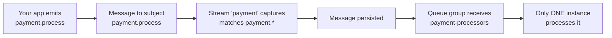

# 🔄 Comprehensive NATS Guide: Subjects, Streams, and Queue Groups

## 📋 Table of Contents

- [Overview](#overview)
- [Key Concepts](#key-concepts)
- [Architecture Overview](#architecture-overview)
- [Pattern 1: Simple Message Patterns](#pattern-1-simple-message-patterns)
- [Pattern 2: Queue Groups](#pattern-2-queue-groups)
- [How Queue Groups Prevent Duplicates](#how-queue-groups-prevent-duplicates)
- [The Role of Streams and Subjects](#the-role-of-streams-and-subjects)
- [Implementation Examples](#implementation-examples)
- [Configuration](#configuration)
- [Decision Matrix](#decision-matrix)
- [Migration Strategy](#migration-strategy)

## 🎯 Overview

This guide covers everything you need to know about using **NATS with NestJS** for autoscaling microservices, including subjects, streams, and queue groups for preventing duplicate processing.

## 🔑 Key Concepts

### **1. Subjects (Message Routing)**
- **🎯 What they are**: NATS core pub/sub message routing mechanism
- **📝 Examples**: `vendor.created`, `user.updated`, `payment.process`
- **💻 In code**: Used for `natsClient.emit()` and `@MessagePattern()`

### **2. Streams (Persistence Layer)**
- **🎯 What they are**: NATS JetStream feature for message persistence and replay
- **⚙️ Where configured**: On the NATS server, not in application code
- **🎯 Purpose**: Automatically capture messages based on subject patterns

### **3. Queue Groups (Load Balancing)**
- **🎯 What they are**: NATS feature that ensures only ONE instance processes each message
- **🎯 Purpose**: Prevent duplicate processing across multiple service instances
- **🎯 When to use**: Critical operations like payment processing

## 🏗️ Architecture Overview



## 📨 Pattern 1: Simple Message Patterns (Current Approach)

### **How It Works**

```typescript
// Service A: Emit message
@Injectable()
export class VendorService {
  constructor(@Inject('NATS_SERVICE') private readonly natsClient: ClientProxy) {}

  async createVendor(vendorData: any) {
    // Emit to subject - streams handle persistence automatically
    this.natsClient.emit('vendor.created', {
      id: vendorData.id,
      name: vendorData.name,
      timestamp: new Date().toISOString(),
    });
  }
}

// Service B: Listen to message
@Injectable()
export class AlgoliaSyncService {
  @MessagePattern('vendor.created')
  async handleVendorCreated(@Payload() vendor: Record<string, unknown>) {
    // This might run on multiple instances, but it's safe (idempotent)
    await this.algoliaService.createObject('vendor', vendor);
  }
}
```

### **Autoscaling Behavior**

```
Instance 1: receives vendor.created → processes it
Instance 2: receives vendor.created → ALSO processes it (duplicate!)
Instance 3: receives vendor.created → ALSO processes it (duplicate!)
```

### **When to Use This Pattern**

| Use Case | Reason | Examples |
|----------|--------|----------|
| **Non-critical operations** | Duplicates are safe | Data synchronization, cache updates |
| **Idempotent operations** | Can run multiple times safely | Algolia sync, email sending |
| **Data synchronization** | Safe to run multiple times | Search indexing, analytics |
| **Notifications** | Safe to send multiple times | Emails, SMS, push notifications |
| **Analytics** | Safe to track multiple times | Event tracking, metrics |

### **Pros & Cons**

| Aspect | Pros | Cons |
|--------|------|------|
| **Implementation** | ✅ Simple to implement | ❌ Multiple instances process same message |
| **NestJS Integration** | ✅ Works with NestJS native patterns | ❌ Can cause duplicate processing |
| **Use Cases** | ✅ Good for non-critical operations | ❌ Not suitable for critical operations |

## 🔒 Pattern 2: Queue Groups (For Critical Operations)

### **How It Works**

```typescript
// Service A: Emit message (same as before)
@Injectable()
export class OrderService {
  constructor(@Inject('NATS_SERVICE') private readonly natsClient: ClientProxy) {}

  async processPayment(paymentData: any) {
    // Emit to subject
    this.natsClient.emit('payment.process', paymentData);
  }
}

// Service B: Listen with queue group
@Injectable()
export class PaymentService {
  constructor(private readonly natsQueueService: NatsQueueService) {}

  initializePaymentQueues(): void {
    this.natsQueueService.subscribeToQueue(
      'payment.process',
      'payment-processors', // Queue group name
      this.handlePaymentProcess.bind(this)
    );
  }

  private async handlePaymentProcess(data: any): Promise<void> {
    // Only ONE instance processes this payment
    await this.processPaymentWithProvider(data);
  }
}
```

### **Autoscaling Behavior**

```
Instance 1: joins 'payment-processors' queue group
Instance 2: joins 'payment-processors' queue group  
Instance 3: joins 'payment-processors' queue group

Message arrives: 'payment.process'
→ NATS automatically routes to only ONE instance in the queue group
→ Instance 2 processes it
→ Instances 1 & 3 do NOT process it
```

### **When to Use This Pattern**

| Use Case | Reason | Examples |
|----------|--------|----------|
| **Critical operations** | Can't tolerate duplicates | Payment processing, order fulfillment |
| **Payment processing** | Double charging is bad! | Credit card processing, refunds |
| **Order fulfillment** | Double shipping is bad! | Inventory management, shipping |
| **Inventory management** | Double reservation is bad! | Stock updates, reservations |
| **User account operations** | Double suspension is bad! | Account status changes |

### **Pros & Cons**

| Aspect | Pros | Cons |
|--------|------|------|
| **Processing** | ✅ Guaranteed single-instance processing | ❌ More complex to implement |
| **Load Balancing** | ✅ Load balancing across instances | ❌ Requires raw NATS client |
| **Use Cases** | ✅ Perfect for critical operations | ❌ Overkill for non-critical operations |

## 🎯 How Queue Groups Prevent Duplicates

### **The Magic of Queue Groups**

When you create a subscription with a queue group:

```typescript
const subscription = nc.subscribe('payment.process', {
  queue: 'payment-processors' // This is the key!
});
```

NATS does the following:

1. **🔗 Groups subscribers**: All instances with the same queue group name form a group
2. **⚖️ Load balances**: NATS automatically distributes messages among group members
3. **🎯 Guarantees single delivery**: Each message goes to exactly ONE member of the group

### **Visual Example**

```
Without Queue Groups:
┌─────────────┐  ┌─────────────┐  ┌─────────────┐
│ Instance 1  │  │ Instance 2  │  │ Instance 3  │
│             │  │             │  │             │
│ vendor.*    │  │ vendor.*    │  │ vendor.*    │
│ (all get    │  │ (all get    │  │ (all get    │
│  same msg)  │  │  same msg)  │  │  same msg)  │
└─────────────┘  └─────────────┘  └─────────────┘

With Queue Groups:
┌─────────────┐  ┌─────────────┐  ┌─────────────┐
│ Instance 1  │  │ Instance 2  │  │ Instance 3  │
│             │  │             │  │             │
│ payment.*   │  │ payment.*   │  │ payment.*   │
│ queue:      │  │ queue:      │  │ queue:      │
│ 'processors'│  │ 'processors'│  │ 'processors'│
└─────────────┘  └─────────────┘  └─────────────┘
                    ↑
              Only this one
              gets the message
```

## 🔄 The Role of Streams and Subjects

### **Subjects: The Routing Layer**

Subjects are the **routing mechanism** used in your application code:

```typescript
// Emit to subject
this.natsClient.emit('vendor.created', data);

// Listen to subject
@MessagePattern('vendor.created')
async handleVendorCreated(@Payload() data: any) {
  // Process the message
}
```

### **Streams: The Persistence Layer**

Streams are configured on the **NATS server** and automatically capture messages:

```bash
# Configure streams on NATS server
nats stream add vendor --subjects "vendor.*" --retention workqueue
nats stream add user --subjects "user.*" --retention workqueue
nats stream add payment --subjects "payment.*" --retention workqueue
```

### **How They Work Together**



### **Streams with Queue Groups**



## 💻 Implementation Examples

### **Current Setup (Simple Patterns)**

```typescript
// apps/algolia-sync/src/algolia-sync.service.ts
@Injectable()
export class AlgoliaSyncService {
  @MessagePattern('vendor.created')
  async handleVendorCreated(@Payload() vendor: Record<string, unknown>) {
    // Safe to run on multiple instances (idempotent)
    await this.algoliaService.createObject('vendor', vendor);
  }
}
```

### **Future Setup (Queue Groups)**

```typescript
// When you add payment processing
@Injectable()
export class PaymentService {
  constructor(private readonly natsQueueService: NatsQueueService) {}

  initializePaymentQueues(): void {
    this.natsQueueService.subscribeToQueue(
      'payment.process',
      'payment-processors',
      this.handlePaymentProcess.bind(this)
    );
  }

  private async handlePaymentProcess(data: any): Promise<void> {
    // Only ONE instance processes this
    await this.processPaymentWithProvider(data);
  }
}
```

## ⚙️ Configuration

### **NATS Server Streams**

```bash
# Create streams for different domains
nats stream add vendor --subjects "vendor.*" --retention workqueue
nats stream add user --subjects "user.*" --retention workqueue
nats stream add payment --subjects "payment.*" --retention workqueue
nats stream add order --subjects "order.*" --retention workqueue
```

### **Application Configuration**

#### **For Simple Patterns (Current)**
```typescript
@Module({
  imports: [
    ClientsModule.registerAsync({
      clients: [{
        name: 'NATS_SERVICE',
        useFactory: (configService: ConfigService) => ({
          transport: Transport.NATS,
          options: {
            servers: configService.get('NATS_URL') || 'nats://localhost:4222',
          },
        }),
        inject: [ConfigService],
      }],
    }),
  ],
})
export class AppModule {}
```

#### **For Queue Groups (Future)**
```typescript
@Module({
  imports: [NatsQueueModule], // Additional module for queue groups
  providers: [PaymentService],
})
export class PaymentModule {}
```

## 📊 Decision Matrix

| Operation Type | Pattern | Reason | Examples |
|----------------|---------|--------|----------|
| **Payment Processing** | Queue Groups | Can't tolerate duplicates | Credit card charges, refunds |
| **Order Fulfillment** | Queue Groups | Can't ship twice | Inventory updates, shipping |
| **Inventory Reservation** | Queue Groups | Can't reserve twice | Stock management, bookings |
| **User Account Operations** | Queue Groups | Can't suspend twice | Account status, permissions |
| **Algolia Sync** | Simple Patterns | Safe to run multiple times | Search indexing, data sync |
| **Email Sending** | Simple Patterns | Safe to send multiple times | Notifications, marketing |
| **Analytics** | Simple Patterns | Safe to track multiple times | Event tracking, metrics |
| **Cache Updates** | Simple Patterns | Safe to update multiple times | Redis updates, CDN |

## 🚀 Migration Strategy

### **Phase 1: Start with Simple Patterns**
- ✅ Use `@MessagePattern` for all operations
- ✅ Make operations idempotent where possible
- ✅ Deploy and test with autoscaling

### **Phase 2: Identify Critical Operations**
- ✅ List operations that can't tolerate duplicates
- ✅ Prioritize by business impact
- ✅ Plan migration order

### **Phase 3: Implement Queue Groups**
- ✅ Add `NatsQueueModule` to critical services
- ✅ Implement queue group handlers
- ✅ Test with multiple instances

### **Phase 4: Monitor and Optimize**
- ✅ Monitor for duplicate processing
- ✅ Track queue group performance
- ✅ Optimize based on metrics

## 🔧 Stream Configuration Examples

### **Vendor Stream**
```bash
nats stream add vendor \
  --subjects "vendor.*" \
  --retention workqueue \
  --max-msgs-per-subject 1000 \
  --max-age 24h \
  --storage file \
  --replicas 1
```

### **User Stream**
```bash
nats stream add user \
  --subjects "user.*" \
  --retention workqueue \
  --max-msgs-per-subject 1000 \
  --max-age 24h \
  --storage file \
  --replicas 1
```

### **Payment Stream**
```bash
nats stream add payment \
  --subjects "payment.*" \
  --retention workqueue \
  --max-msgs-per-subject 10000 \
  --max-age 7d \
  --storage file \
  --replicas 3
```

## 📈 Performance Considerations

### **Stream Retention**
- **Workqueue**: Messages are removed after being processed
- **Limits**: Set appropriate message limits and age limits
- **Storage**: Choose between memory and file storage

### **Queue Group Performance**
- **Load Balancing**: NATS automatically distributes load
- **Fault Tolerance**: If one instance fails, others continue processing
- **Scaling**: Add/remove instances without downtime

### **Monitoring**
- **Message Rates**: Monitor messages per second
- **Queue Depth**: Track queue lengths
- **Processing Time**: Measure message processing duration

## 🧪 Testing

### **Testing Simple Patterns**
```typescript
describe('AlgoliaSyncService', () => {
  it('should handle vendor.created message', async () => {
    const vendor = { id: '123', name: 'Test Vendor' };
    
    await service.handleVendorCreated(vendor);
    
    expect(algoliaService.createObject).toHaveBeenCalledWith('vendor', vendor);
  });
});
```

### **Testing Queue Groups**
```typescript
describe('PaymentService', () => {
  it('should process payment with queue group', async () => {
    const paymentData = { amount: 100, currency: 'USD' };
    
    await service.handlePaymentProcess(paymentData);
    
    expect(paymentProvider.processPayment).toHaveBeenCalledWith(paymentData);
  });
});
```

## 🎯 Summary

| Concept | Purpose | When to Use |
|---------|---------|-------------|
| **Subjects** | Message routing (used in your code) | Always - for all message patterns |
| **Streams** | Persistence layer (configured on NATS server) | Always - for message durability |
| **Simple Patterns** | Multiple instances process same message | Non-critical, idempotent operations |
| **Queue Groups** | Only one instance processes each message | Critical operations that can't tolerate duplicates |

Your current setup uses **simple patterns** for safe operations. When you add critical operations like payment processing, you can implement **queue groups** using the `NatsQueueService` infrastructure that's already available.

---

**This comprehensive guide provides everything you need to implement scalable, reliable message processing with NATS in your microservices architecture.** 